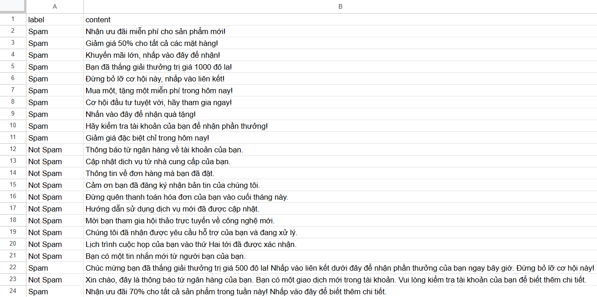
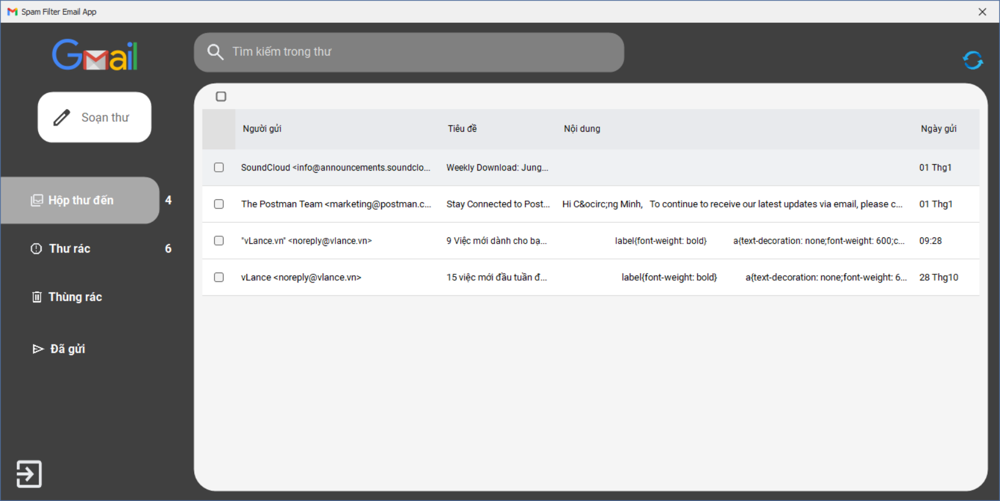

# SpamFilterApp - Ứng dụng Lọc Email Spam

## Giới thiệu

SpamFilterApp là một ứng dụng Windows Forms được phát triển bằng C# và .NET Framework, sử dụng thuật toán Naive Bayes để phân loại email thành "Spam" hoặc "Not Spam". Ứng dụng này giúp người dùng kiểm tra và phân loại email, đồng thời cung cấp khả năng báo cáo email spam để cải thiện độ chính xác của mô hình phân loại.

### Thông tin sinh viên

- **Họ và tên:** Trần Công Minh
- **Trường:** Đại học Công Thương (HUIT)
- **Ngành:** Công nghệ thông tin
- **Email:** tcongminh1604@gmail.com
- **Số điện thoại:** (+84)777999496

## Tính năng chính

- Phân loại email thành "Spam" hoặc "Not Spam" sử dụng thuật toán Naive Bayes
- Hiển thị xác suất spam và không spam cho mỗi email
- Hiển thị biểu đồ phân tích xác suất của từng từ trong email
- Lưu lịch sử phân loại email
- Cho phép người dùng báo cáo email không spam thành spam để cải thiện mô hình
- Hỗ trợ nhập nội dung email từ tệp văn bản

## Yêu cầu hệ thống

- Microsoft Windows 7 trở lên
- .NET Framework 4.5 trở lên
- DevExpress (được sử dụng cho giao diện người dùng và biểu đồ)
- CsvHelper (được sử dụng để đọc và ghi dữ liệu CSV)

## Cài đặt

### Trước khi bắt đầu

1. Bạn cần tạo file `credentials.json` cho Google API để sử dụng tính năng kết nối với Gmail.
2. Sao chép file `credentials.json.example` và đổi tên thành `credentials.json`.
3. Đăng ký ứng dụng tại [Google Cloud Console](https://console.cloud.google.com/) và nhận client_id và client_secret.
4. Điền thông tin client_id và client_secret vào file `credentials.json`.

### Các bước cài đặt

1. Đảm bảo máy tính của bạn đã cài đặt .NET Framework 4.5 trở lên
2. Cài đặt DevExpress (nếu chưa có)
3. Clone hoặc tải xuống mã nguồn từ repository
4. Mở file `SpamEmailFilter/SpamFilterApp/SpamFilterApp.sln` bằng Visual Studio
5. Khôi phục các gói NuGet (CsvHelper)
6. Build và chạy ứng dụng

## Cách sử dụng

### Phân loại email

1. Nhập nội dung email vào ô văn bản hoặc nhấn "Browse" để chọn tệp văn bản
2. Nhấn nút "Phân loại" để phân loại email
3. Kết quả phân loại sẽ hiển thị cùng với xác suất spam và không spam
4. Biểu đồ sẽ hiển thị xác suất của từng từ trong email

### Báo cáo email spam

1. Chọn một email đã được phân loại là "Not Spam" từ danh sách lịch sử
2. Nhấn nút "Báo cáo Spam" để đánh dấu email đó là spam
3. Xác nhận hành động của bạn
4. Email sẽ được thêm vào tập dữ liệu spam và mô hình sẽ được cập nhật

## Demo hình ảnh ứng dụng

Dưới đây là một số hình ảnh minh họa cho ứng dụng SpamFilterApp:

### Dataset



### Giao diện chính



## Cấu trúc dự án

```
SpamFilterApp/
├── Dataset/
│   └── email_dataset.csv       # Tập dữ liệu huấn luyện
├── SpamEmailFilter/
│   └── SpamFilterApp/
│       ├── SpamFilterApp/      # Dự án chính
│       │   ├── MainForm.cs     # Giao diện người dùng chính
│       │   ├── Email.cs        # Lớp đại diện cho email
│       │   ├── EmailData.cs    # Lớp đại diện cho dữ liệu email từ CSV
│       │   ├── ClassificationResult.cs # Lớp kết quả phân loại
│       │   └── NaiveBayesClassifier.cs # Thuật toán phân loại Naive Bayes
│       └── SpamEmaiAlpp/       # Dự án phụ
├── NormalEmail_Exp.txt         # Ví dụ email thường
└── SpamEmail_Exp.txt           # Ví dụ email spam
```

## Thuật toán Naive Bayes

Ứng dụng sử dụng thuật toán Naive Bayes để phân loại email. Đây là một thuật toán phân loại xác suất dựa trên định lý Bayes với giả định "ngây thơ" rằng các đặc trưng (từ trong email) là độc lập với nhau.

### Nguyên lý hoạt động

1. **Huấn luyện mô hình**:

   - Đếm số lần xuất hiện của mỗi từ trong các email spam và không spam
   - Tính tổng số email spam và không spam
   - Tính tổng số từ trong tập dữ liệu spam và không spam

2. **Phân loại email**:

   - Tính xác suất tiên nghiệm P(Spam) và P(Not Spam)
   - Với mỗi từ trong email cần phân loại, tính xác suất P(word|Spam) và P(word|Not Spam)
   - Áp dụng định lý Bayes để tính xác suất P(Spam|email) và P(Not Spam|email)
   - So sánh hai xác suất và phân loại email vào lớp có xác suất cao hơn

3. **Xử lý từ không xuất hiện trong tập huấn luyện**:
   - Sử dụng kỹ thuật Laplace smoothing để tránh xác suất bằng 0

### Công thức

- P(Spam|email) ∝ P(Spam) × ∏ P(word_i|Spam)
- P(Not Spam|email) ∝ P(Not Spam) × ∏ P(word_i|Not Spam)

Trong đó:

- P(Spam) = số email spam / tổng số email
- P(Not Spam) = số email không spam / tổng số email
- P(word|Spam) = (số lần word xuất hiện trong email spam + 1) / (tổng số từ trong email spam + số từ duy nhất)

## Tài liệu tham khảo

- [Naive Bayes Classifier](https://en.wikipedia.org/wiki/Naive_Bayes_classifier)
- [Text Classification using Naive Bayes](https://towardsdatascience.com/text-classification-using-naive-bayes-theory-a-working-example-2ef4b7eb7d5a)
- [DevExpress Documentation](https://docs.devexpress.com/)
- [CsvHelper Documentation](https://joshclose.github.io/CsvHelper/)

## Giấy phép

© 2024 Trần Công Minh. Đại học Công Thương (HUIT).
